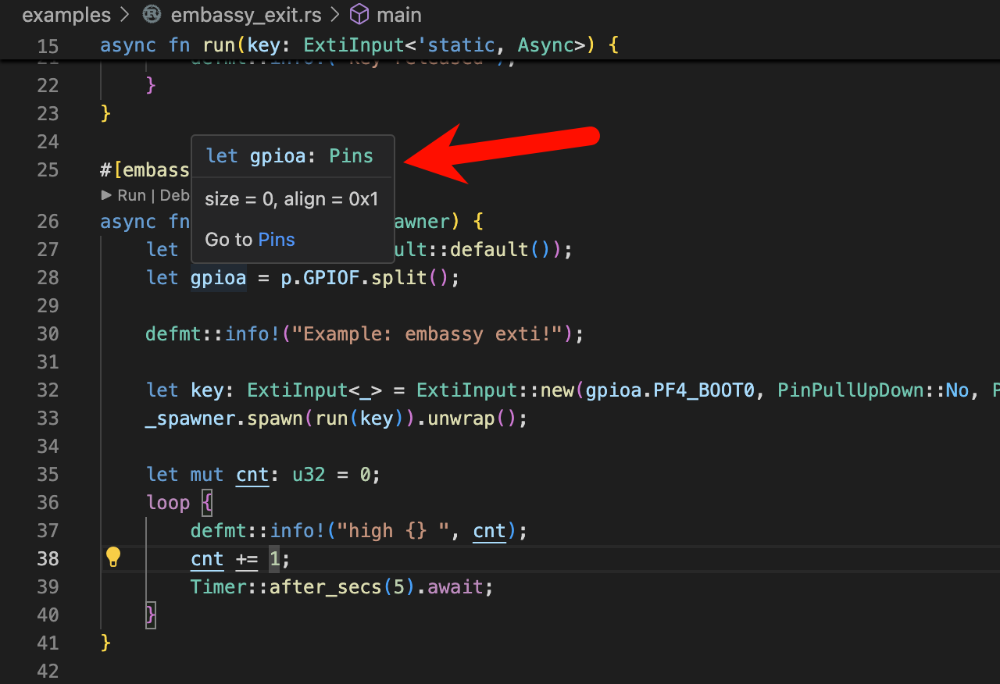

# Cargo 

Cargo 集成了非常多的工具和包用与构建 Rust 应用、管理包依赖。用户可以定制构建脚本 `cargo.toml` 文件增加包依赖、编译选项、features 等， 也可使用相应的 cargo 命令自动修改 `cargo.toml`。

## 常用的 Cargo 命令

### Clippy

`Clippy` 是一个 Lint 工具，用于实时捕获常见的语法错误或警告、代码风格提示等，并提供修复建议。可设置 Clippy 的检查类型和等级。

### Rust-analyzer
`rust-analyzer` 是 Rust 基金会开源的语言服务协议（LSP），当代码改动时，用于提供代码语意分析，提供自动补全，变量类型提示、变量跳转等功能，也能提供代码修改建议。

在 VSCode 中安装插件 [rust-analyzer](https://marketplace.visualstudio.com/items?itemName=rust-lang.rust-analyzer) 后可以使用。


### Rustfmt
`rustfmt` 是一个代码格式化工具，用于按照社区代码风格自动格式化代码。当 Rust 安装时， rustfmt 会自动安装。
``` bash
# 格式化单个文件
rustfmt build.rs

# 格式化整个 crate
cargo fmt
``` 
### 其他

#### 检查

只检查 crate 语法，不编译，通常用来节省时间
``` bash
cargo check
# or
cargo c
```

#### 编译

编译 crate 或 指定的例程目标
``` bash
# 编译当前 crate
cargo build
# or
cargo b
# 编译 example 目录下的例程文件 XX
cargo b --example XX
# 以 release 模式编译例程 XX
cargo b --example XX --release
# 编译例程并使能 feature FFF
cargo b --example XX --feature FFF
```

#### 下载 & 运行

下载 elf 固件到芯片并运行，probe-rs 会实时打印来自单片机的日志
``` bash
# 下载并运行
cargo run
# or
cargo r
# 以 release 模式运行
cargo r --release
# 运行 例程
cargo r --example blinky --release
```

#### 模板创建工程
``` bash
# 使用远程仓库模板创建工程
cargo install cargo-generate
```

#### [固件分析工具](https://github.com/rust-embedded/cargo-binutils)
``` bash
cargo install cargo-binutils
rustup component add llvm-tools-preview
```