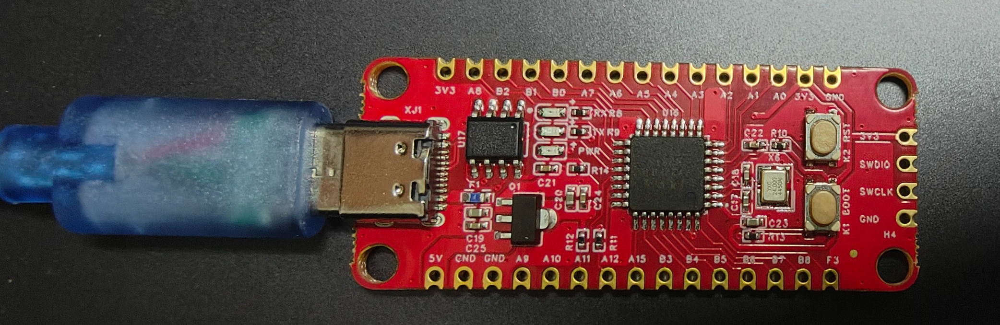

# 串口烧录程序

Py32_Rust_Dev 主板支持串口烧录,只需要连接 Type-C 到电脑即可。



# Pyisp

该工具用于串口烧录 bin 文件到 Py32F030 芯片。


## 获取源码 及安装到cargo 路径
``` bash
git clone https://github.com/hysonglet/pyisp.git
cd pyisp
cargo install --path .
```

## 常用命令
``` bash
# 查看帮助
pyisp -h

# 查看当前连接的串口
pyisp -p

# 下载并运行
pyisp -s tty.usbserial-130 -f test.bin -g

# 循环下载
pyisp -s tty.usbserial-130 -f tttt.bin -g -c
```

## 串口下载操作
1. 按下 `boot` 键
2. 按下 `reset` 键（保持boot键按下状态）
3. 释放 `reset` 键
4. 0.5 秒后释放 `boot` 键
