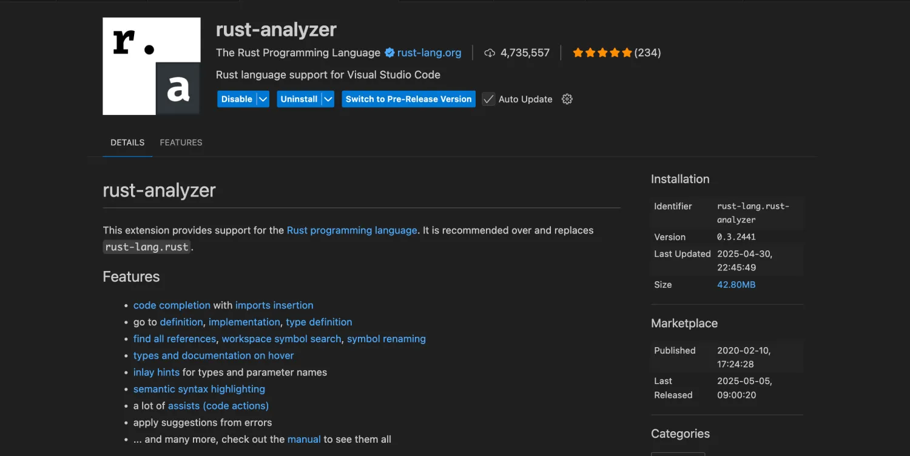

# 嵌入式 Rust 开发推荐安装的插件
在嵌入式开发领域，Rust 凭借其内存安全、高性能以及对底层的良好控制能力，逐渐成为开发者的新宠。然而，要想在嵌入式 Rust 开发中如鱼得水，一套好用的插件必不可少。它们能帮你提升代码编写效率、优化调试流程、简化构建过程。今天，就为大家推荐几款嵌入式 Rust 开发必备插件！

## Rust Analyzer
Rust Analyzer 堪称 Rust 开发者的 “智能大脑”。它为编辑器提供了强大的代码分析功能，能够实现实时的语法检查、代码补全、函数定义跳转等功能。在嵌入式开发中，当你面对复杂的硬件驱动代码和大量的结构体、枚举时，Rust Analyzer 能快速定位定义、提示可能的错误，极大提高编码速度。Rust Analyzer支持多个编辑器，如VSCode，Vim，Zed等。



## Probe-rs
Probe - rs 是一个用于与嵌入式设备进行交互的调试工具，主要有以下功能：

+ **设备探测与连接**：能够自动探测连接到计算机的嵌入式设备，支持多种调试探针，如 J-Link、ST - Link 等，方便用户快速建立与目标设备的连接。
+ **闪存编程**：可以将编译好的程序固件下载到嵌入式设备的闪存中，支持擦除、写入等操作，并且能够优化编程速度，减少烧写时间。
+ **调试支持**：提供了丰富的调试功能，包括设置断点、单步执行、查看寄存器和内存值等。还支持实时调试，允许开发者在程序运行时动态查看变量变化和程序执行流程，有助于快速定位和解决代码中的问题。
+ **脚本与自动化**：支持通过脚本语言编写自动化任务，例如批量烧写固件、执行一系列调试操作等，提高开发效率，减少重复性工作。
+ **支持多种平台**：兼容多种操作系统，如 Windows、Linux 和 macOS，并且对不同的嵌入式芯片平台有广泛的支持，包括 ARM Cortex - M 系列等常见的微控制器。

## Cargo Watch
Cargo 是 Rust 的包管理器和构建工具，而 Cargo Watch 插件则能让你的构建过程更加智能。它会实时监控项目中的文件变化，一旦检测到代码修改，就会自动重新构建项目。在嵌入式开发中，频繁的代码修改和构建是常态，Cargo Watch 能帮你省去手动输入构建命令的步骤，让你专注于代码编写，提升开发效率，同时提升编译速度。

```rust
# 安装 watch 命令
cargo install cargo-watch

# 监视源代码的变化, 编辑时候出现任意修改将会触发 cargo check 命令
cargo watch -x check
```

## Cargo Check
`cargo check` 是 Rust 开发中一个轻量级且高效的代码验证命令，作为 `cargo` 工具链的核心功能之一，它的主要作用是**快速检查代码是否能通过编译**，但**不生成可执行文件**。以下是其核心功能的简要介绍：

### **1. 核心功能**
+ **语法检查**：验证代码是否符合 Rust 语法规则，如变量声明、函数调用、生命周期标注等。
+ **类型检查**：确保所有表达式的类型正确且兼容，例如不会将 `String` 赋值给需要 `i32` 的变量。
+ **借用检查**：执行 Rust 的所有权系统检查，防止悬垂引用、数据竞争等内存安全问题。
+ **快速反馈**：相比 `cargo build`，跳过了生成二进制文件的耗时步骤，通常能在几秒内完成检查。

### 2. 为什么需要`cargo check`
+ **提升开发效率**：在频繁修改代码时，快速验证代码正确性，避免等待完整编译的时间（尤其是大型项目）。
+ **CI/CD 集成**：在自动化测试流程中作为第一步，快速过滤语法错误和类型错误。
+ **轻量级验证**：当你只需要确认代码能否编译，而不需要运行程序时（如提交代码前的检查）。

### **3. 常用参数**
```bash
cargo check           # 检查当前包
cargo check --all     # 检查工作空间中的所有包
cargo check --tests   # 检查测试代码
cargo check --release # 按 release 模式检查（启用优化）
cargo check --features "feature1 feature2" # 检查特定特性
```

## Clippy
Cargo Clippy 是 Rust 生态系统中的一个重要工具，它作为 `cargo` 的一个子命令存在，主要用于提供更高级的代码分析和风格检查。以下是其核心功能的简要介绍：

1. **代码风格检查**  
除了 Rustfmt 提供的格式化功能外，Clippy 会检查代码是否符合社区公认的最佳实践，例如：
    - 检测冗余代码（如未使用的变量、导入或注释）
    - 发现潜在的逻辑错误（如比较浮点数是否相等）
    - 推荐更简洁、更符合 Rust 习惯的写法
2. **性能优化建议**  
它能识别出性能低下的代码模式，并提供优化建议，例如：
    - 避免不必要的克隆（cloning）操作
    - 推荐使用更高效的数据结构或算法
    - 检测可能导致堆分配的低效模式
3. **安全漏洞检测**  
Clippy 可以帮助发现潜在的安全风险，例如：
    - 检测硬编码的敏感信息（如 API 密钥）
    - 识别可能导致 panic 的不安全操作
    - 发现可能引发竞态条件的并发代码
4. **可配置的检查规则**  
Clippy 提供了超过 400 条 lints（检查规则），可以根据项目需求选择性启用或禁用。例如：

```toml
# 在项目的 .clippy.toml 中配置
deny = ["clippy::unwrap_used"]  # 禁止使用 unwrap()
warn = ["clippy::needless_borrow"]  # 对不必要的借用发出警告
```

5. **与开发流程集成**  
可以在 CI/CD 流程中自动运行 Clippy，确保代码质量：

```bash
cargo clippy --all-targets --all-features -- -D warnings
```

**为什么需要 Clippy？**  
虽然 Rust 编译器本身已经非常严格，但 Clippy 提供了更细致的检查，帮助开发者写出更专业、更安全、更高效的代码。它是 Rust 开发中不可或缺的质量保障工具。

## Cargo fmt
Cargo fmt 是 Rust 官方提供的代码格式化工具，作为 `cargo` 的子命令存在，用于自动统一代码风格，消除团队成员间的格式争议，提升代码可读性和一致性。以下是其核心功能的简要介绍：

1. **自动格式化代码**  
按照 Rust 社区公认的风格指南，自动调整代码格式，包括：
    - 缩进（默认 4 个空格）
    - 行宽限制（默认 100 个字符）
    - 大括号位置（K&R 风格）
    - 空格与逗号的使用
    - 导入模块的分组与排序
2. **一键统一风格**  
只需执行以下命令，即可格式化整个项目：

```bash
cargo fmt
```

支持通过 `--check` 参数验证代码是否已格式化，常用于 CI/CD 流程：

```bash
cargo fmt --check
```

3. **高度可配置**  
通过项目根目录下的 `.rustfmt.toml` 文件，可以自定义格式化规则，例如：

```toml
# .rustfmt.toml
max_width = 120          # 调整行宽限制
indent_style = "Spaces"  # 使用空格缩进
fn_single_line = true    # 单行函数样式
```

4. **与编辑器深度集成**  
在 VS Code、IntelliJ、Vim 等主流 IDE 中安装 Rust 插件后，保存文件时可自动触发格式化，保持代码风格实时统一。
5. **与 Rust 编译器无缝协作**  
Cargo fmt 生成的代码完全符合 Rust 语法，不会引入编译错误，确保格式化过程的安全性。

**为什么需要 Cargo fmt？**  
在团队协作中，手动维护代码风格不仅耗时耗力，还容易引发争议。Cargo fmt 通过自动化手段解决了这一问题，让开发者可以专注于代码逻辑而非格式细节。它是 Rust 生态中保证代码质量和可维护性的基础工具。

## cargo-binutils
cargo - binutils 是一组与 Rust 项目二进制文件处理相关的工具，它扩展了`cargo`命令的功能，主要有以下作用：

+ **反汇编功能**：可以将 Rust 编译生成的二进制文件进行反汇编，生成汇编代码。这对于分析程序的底层实现、优化代码以及理解程序在机器层面的执行过程非常有帮助。例如，通过反汇编可以查看函数的调用过程、指令的执行顺序等，有助于发现潜在的性能问题或代码错误。
+ **目标文件处理**：能够对目标文件进行操作，如查看目标文件的符号表、节区信息等。符号表包含了程序中定义和引用的符号名称及其相关信息，节区信息则描述了目标文件中不同部分的内容和属性。这些信息对于调试、链接以及理解程序的内存布局很有价值。
+ **链接控制**：提供了对链接过程的一些控制选项。可以指定链接脚本、调整链接顺序等，以便更好地满足特定项目的需求，例如在嵌入式开发中，可能需要根据硬件的内存布局来定制链接过程，确保程序能够正确地在目标设备上运行。
+ **与 cargo 集成**：作为`cargo`的插件，它与`cargo`的工作流程紧密结合。可以在`cargo`命令中方便地调用相关功能，例如`cargo objdump`用于反汇编，`cargo readelf`用于查看目标文件信息等，使得在 Rust 项目中处理二进制文件更加便捷和高效。

通过这些功能，cargo - binutils 为 Rust 开发者提供了更底层、更细致的工具，有助于深入理解和优化 Rust 程序的二进制输出，特别是在性能分析、调试以及与底层硬件交互的场景中非常有用。

```bash
# 安装工具链
cargo install cargo-binutils
# 安装 LLVM 工具链依赖
rustup component add llvm-tools-preview  

# 查看二进制的资源占用
cargo size --release

# 查看目标固件的汇编代码
cargo objdump -- -d -S

# 查看各段的地址、大小等信息
cargo readobj -- --sections

# 移除 release 构建的调试符号
cargo strip --release  

# 查找各函数符号及地址
cargo nm   

# 生成bin格式的目标文件
cargo objcopy -- -O binary

# 生成hex的目标文件
cargo objcopy -- -O ihex
```

