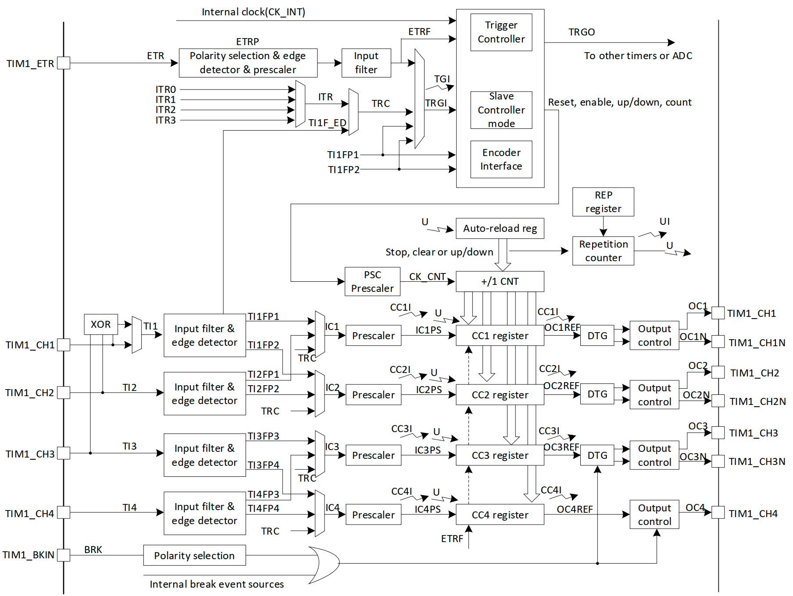

# 高级定时器

PY32F030 的内部有一个高级定时器TIM1，是一个16位可编程的定时器，可用于多种场合，如基础定时功能，输入脉冲测量，输出PWM。TIM1的主要特性如下：

- 16bit 可配置的向下、向上、上下重载模式
- 16位的分频器，支持1～65535的分频
- 4 个独立的通道，可用于
    - 输入脉冲捕获
    - 输出比较
    - PWM
    - 单脉冲输出
- 支持互补输出的死区配置
- 外部信号控制定时器或定时器级联控制
- DMA 操作
- 中断事件
    - 更新事件
    - 触发事件
    - 输入捕获事件
    - 输出比较
    - 刹车输入
- 支持正交编码与霍尔传感器电路



在驱动包 `py32f030-hal` 中，目前已实现常用的定时、PWM输出、中断等功能,扩展其他功能也非常简单。以下将提供裸机环境操作定时器以及多任务系统中操作定时器的例程。

## 示例1: 定时：`examples/advanced_timer_block.rs`
``` rust
#![no_std]
#![no_main]

use embedded_hal::digital::v2::ToggleableOutputPin;
use hal::gpio::{Output, PinIoType, PinSpeed};
use hal::mode::Blocking;
use hal::timer::advanced_timer::AnyTimer;
use py32f030_hal as hal;

use {defmt_rtt as _, panic_probe as _};

#[cortex_m_rt::entry]
fn main() -> ! {
    defmt::info!("timer counter examples start...");
    let p = hal::init(Default::default());

    let gpioa = p.GPIOA.split();

    let timer = AnyTimer::<_, Blocking>::new(p.TIM1).unwrap();
    let mut counter = timer.as_counter();

    let mut led = Output::new(gpioa.PA0, PinIoType::PullUp, PinSpeed::Low);

    let mut cnt = 0;

    loop {
        let _ = led.toggle();
        // 延时 1s
        counter.delay_us_blocking(1_000_000);
        defmt::info!("{}", cnt);
        cnt += 1;
    }
}
```
运行：`cargo r --example advanced_timer_block`

## 示例2: `examples/advanced_timer_block_2.rs`
``` rust
#![no_std]
#![no_main]

use embedded_hal::timer::CountDown;
use fugit::ExtU32;
use hal::mode::Blocking;
use hal::timer::advanced_timer::AnyTimer;
use py32f030_hal as hal;

use {defmt_rtt as _, panic_probe as _};

#[cortex_m_rt::entry]
fn main() -> ! {
    defmt::info!("timer counter examples start...");
    let p = hal::init(Default::default());

    let timer = AnyTimer::<_, Blocking>::new(p.TIM1).unwrap();
    let mut counter = timer.as_counter();

    let mut cnt = 0;
    loop {
        // 延时 5s
        defmt::info!("repeat...{} ", cnt);
        counter.start(5u32.secs());
        let _ = counter.wait();
        cnt += 1;
    }
}
```
运行：`cargo r --example advanced_timer_block_2`

## 示例3:PWM输出:`examples/embassy_pwm.rs`
配置输出 PWM 波形
``` rust
#![no_std]
#![no_main]

// use hal::gpio::{Af, PinIoType, PinSpeed};
// use hal::timer::advanced_timer::TimerChannel1Pin;
use hal::timer::advanced_timer::{AnyTimer, ChannelConfig, ChannelOutputConfig};
use py32f030_hal::gpio::gpioa::PA0;
use py32f030_hal::{self as hal, mode::Blocking, timer::advanced_timer::Channel};

use embassy_executor::Spawner;
use embassy_time::Timer;
// use hal::mcu::peripherals::TIM1;
use embedded_hal::Pwm;

use {defmt_rtt as _, panic_probe as _};

#[embassy_executor::task]
async fn run() {
    loop {
        Timer::after_secs(2).await;
        defmt::info!("task run");
    }
}

#[embassy_executor::main]
async fn main(_spawner: Spawner) {
    defmt::info!("time1 start...");
    let p = hal::init(Default::default());
    let gpioa = p.GPIOA.split();

    _spawner.spawn(run()).unwrap();

    let timer: AnyTimer<_, Blocking> = AnyTimer::new(p.TIM1).unwrap();
    let mut pwm = timer.as_pwm();

    let channel_1_pin = gpioa.PA3;

    // 引脚指定方式1
    // let _oc1_pin = Af::new(
    //     channel_1_pin, //gpioa.PA3,
    //     PinAF::AF13,
    //     PinSpeed::VeryHigh,
    //     PinIoType::PullUp,
    // );

    // 引脚指定方式2
    // channel_1_pin.set_instance_af(PinSpeed::VeryHigh, PinIoType::PullUp);

    // 引脚指定方式3
    // PA0，指定为OC_N, 当为None时候不会被使用，当引脚没有被模版冲突则不需要指定模版类型
    pwm.set_channel_1_pin::<_, PA0>(Some(channel_1_pin), None);

    // 配置定时器
    pwm.config(
        /* 配置通道1 */
        Some(ChannelConfig::default().ch(ChannelOutputConfig::default())),
        None,
        None,
        None,
    );

    // 计数频率为1M
    pwm.set_frequency(1_000_000);
    // 设置计数周期为1000，则波形的频率为 1000_000/1000 = 1K
    pwm.set_period(1000u16 - 1);
    let max_duty = pwm.get_max_duty();
    // 33%的占空比
    pwm.set_duty(Channel::CH1, max_duty / 3);
    // 使能通道
    pwm.enable(Channel::CH1);
    // 开始计数器
    pwm.start();

    loop {
        Timer::after_secs(1).await;
    }
}
```
运行： `cargo r --example embassy_pwm`