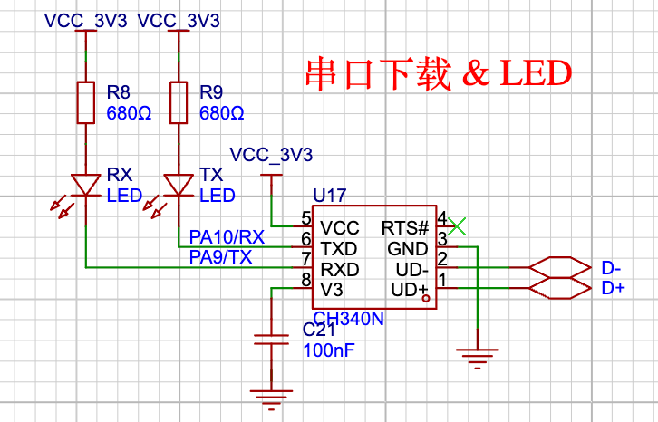

本篇将介绍如何基于 Rust 的 hal 库快速点亮 dev 主板的 led 灯。

在单片机的学习中，点灯是开发者的一个入门仪式，点亮一个 led 灯，将会带你进入新世界的大门，让你感受软件如何控制硬件。

## 硬件
在 `Py32_Rust_dev_V1.1` 开发版中，LED 的相关原理图如下：



从图中可以看出，开发版有 2 个可以通过 GPIO 引脚控制的 LED，且这两个引脚与串口下载的电路复用。因此在点灯的同时可能会影响串口的正常工作，理论上是不能同时使用。

Rust 的库接口已经保证 PA10 和 PA11 引脚只能在一种场合安全被使用，因此在本篇使用 LED GPOIO 控制亮灭的实验中，请不要去使用其他非常手段来做串口的引脚，当然鼓励去尝试一起使用，感受 Rust 的安全特性，本篇仅分享如何使用  GPIO 控制 LED 闪烁。

## LED 代码：`examples/blinky.rs`
``` rust
#![no_std]
#![no_main]

use embedded_hal::digital::v2::ToggleableOutputPin;
use hal::gpio::{Output, PinIoType, PinSpeed};
use py32f030_hal as hal;

use {defmt_rtt as _, panic_probe as _};

#[cortex_m_rt::entry]
fn main() -> ! {
    let p = hal::init(Default::default());

    defmt::info!("Led blinky testing...");

    let gpioa = p.GPIOA.split();
    let mut led = Output::new(gpioa.PA10, PinIoType::PullDown, PinSpeed::Low);

    loop {
        // 翻转led
        let _ = led.toggle();
        cortex_m::asm::delay(10_000_000);
    }
}
```

## 编译&运行
``` bash
cargo r --example blinky
```

## 效果
``` bash
➜  py32f030-hal git:(main) ✗ cargo r --example blinky
warning: unused manifest key: dependencies.embedded-io-async.option
   Compiling py32f030_hal v0.1.0 (/Users/hunter/mywork/py32/py32f030-hal)
    Finished `dev` profile [optimized + debuginfo] target(s) in 0.48s
     Running `probe-rs run --chip PY32F030x8 target/thumbv6m-none-eabi/debug/examples/blinky`
      Erasing ✔ [00:00:00] [######################################################################################################################] 12.00 KiB/12.00 KiB @ 57.31 KiB/s (eta 0s )
  Programming ✔ [00:00:04] [#######################################################################################################################] 10.62 KiB/10.62 KiB @ 2.53 KiB/s (eta 0s )    Finished in 4.483s
INFO  Led blinky testing...
└─ blinky::__cortex_m_rt_main @ examples/blinky.rs:14
```

图片：TODO

## 进一步测试：`examples/embassy_blinky.rs`

如何在多个任务中闪烁不同的 LED？ 参考以下代码，并尝试修改你好奇的地方。
``` rust
//! 在不同的任务中闪烁不同的 LED， 学习多任务操作
//!

#![no_std]
#![no_main]

use embassy_executor::Spawner;
use embassy_time::Timer;
use embedded_hal::digital::v2::ToggleableOutputPin;
use hal::gpio::{Output, PinIoType, PinSpeed};
use py32f030_hal::{
    self as hal,
    gpio::{AnyPin, Pin},
};

use {defmt_rtt as _, panic_probe as _};

#[embassy_executor::task(pool_size = 2)]
async fn run_led(led: AnyPin, delay_ms: u64) {
    let mut led = Output::new(led, PinIoType::PullDown, PinSpeed::Low);
    loop {
        let _ = led.toggle();
        Timer::after_millis(delay_ms).await;
    }
}

#[embassy_executor::main]
async fn main(spawner: Spawner) {
    let p = hal::init(Default::default());

    defmt::info!("Testing the flashing of different LEDs in multi-tasking.");

    let gpioa = p.GPIOA.split();

    // spawner.must_spawn(run_led(gpioa.PA9.degrade(), 1000));
    // spawner.must_spawn(run_led(gpioa.PA10.degrade(), 2000));

    spawner.spawn(run_led_1(gpioa.PA9.degrade(), 1000)).unwrap();
    spawner.spawn(run_led_1(gpioa.PA10.degrade(), 500)).unwrap();

    loop {
        Timer::after_secs(2).await;
    }
}

```

图片：TODO

### 也许你有疑惑的地方

1. `pool_size = 2`  表示异步任务 `async fn run_led(led: AnyPin, delay_ms: u64)` 最多能被 2 个任务使用
2. `async` 表示函数为异步函数
3. `embassy_executor::task` 表示将定义一个异步任务
4. `Spawner` 是异步执行器框架提供的一个类型，它的主要职责是在执行器的任务调度环境中创建新的异步任务。它封装了任务创建的具体细节和逻辑，例如确定任务应该在哪个任务池中运行、分配任务所需的资源（如栈空间等）以及将任务注册到执行器的任务队列中以便后续调度执行。
5.  embassy 的 异步入口函数定义为：
``` rust
#[embassy_executor::main] 
async fn main(spawner: Spawner) {

}
```
6. `spawner.spawn()`: `spawn` 方法是将一个异步函数（或异步闭包）包装成一个任务，并将其放入异步执行器的任务调度队列中，以便在合适的时候执行。这个方法是异步执行器框架提供的关键接口，用于启动新的异步任务并将其纳入任务管理体系。