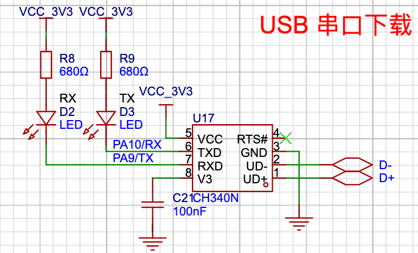

本篇将介绍如何基于 Rust 的 hal 库快速点亮 dev 主板的 led 灯。

在单片机的学习中，点灯是开发者的一个入门仪式，点亮一个 led 灯，将会带你进入新世界的大门，让你感受软件如何控制硬件。

## 硬件
在 `Py32_Rust_dev_V1.1` 开发版中，LED 的相关原理图如下：



从图中可以看出，开发版有 2 个可以通过 GPIO 引脚控制的 LED，且这两个引脚与串口下载的电路复用。因此在点灯的同时可能会影响串口的正常工作，理论上是不能同时使用。

Rust 的库接口已经保证 `PA10` 和 `PA11` 引脚只能在一种场合安全被使用，因此在本篇使用 LED GPOIO 控制亮灭的实验中，请不要去使用其他非常手段来做串口的引脚，当然鼓励去尝试一起使用, 甚至尝试修改代码把同一引脚创建多个 `Output` 对象，去感受 Rust 的安全特性。本篇仅分享如何使用  GPIO 控制 LED 闪烁。

在原理图图中有以下信息在编程中会用到：
- RX LED：PA9
- TX LED：PA10
- 当引脚为 低电平时，LED 亮，反之则灭

## 测试代码：`examples/blinky.rs`
``` rust
#![no_std]
#![no_main]

use embedded_hal::digital::v2::ToggleableOutputPin;
use hal::gpio::{Output, PinIoType, PinSpeed};
use py32f030_hal as hal;

use {defmt_rtt as _, panic_probe as _};

#[cortex_m_rt::entry]
fn main() -> ! {
    let p = hal::init(Default::default());

    defmt::info!("Led blinky testing...");

    let gpioa = p.GPIOA.split();
    let mut led = Output::new(gpioa.PA10, PinIoType::PullDown, PinSpeed::Low);

    loop {
        // 翻转led
        let _ = led.toggle();
        cortex_m::asm::delay(10_000_000);
    }
}
```

## 编译&运行
``` bash
cargo r --example blinky
```

## 效果
``` bash
➜  py32f030-hal git:(main) ✗ cargo r --example blinky
warning: unused manifest key: dependencies.embedded-io-async.option
   Compiling py32f030_hal v0.1.0 (/Users/hunter/mywork/py32/py32f030-hal)
    Finished `dev` profile [optimized + debuginfo] target(s) in 0.48s
     Running `probe-rs run --chip PY32F030x8 target/thumbv6m-none-eabi/debug/examples/blinky`
      Erasing ✔ [00:00:00] [######################################################################################################################] 12.00 KiB/12.00 KiB @ 57.31 KiB/s (eta 0s )
  Programming ✔ [00:00:04] [#######################################################################################################################] 10.62 KiB/10.62 KiB @ 2.53 KiB/s (eta 0s )    Finished in 4.483s
INFO  Led blinky testing...
└─ blinky::__cortex_m_rt_main @ examples/blinky.rs:14
```

图片：TODO


###  你可能好奇的地方
1. 为什么添加 `use embedded_hal::digital::v2::ToggleableOutputPin;`？
引用这个 trait后，`Output` 实例将能在该代码范围使用 `ToggleableOutputPin` 的函数，当然 `Output` 已经在文件 `src/gpio/mod.rs` 中实现了 `ToggleableOutputPin`, 因此 Output 具备了 `ToggleableOutputPin` trait 的能力, 如果不引用 `ToggleableOutputPin` , 则 `Outout` 的 `toggle` 接口将被隐藏不能使用。
2. 为什么没有开启 GPIOA 外设的时钟地方？因为在 `p.GPIOA.split();` 中，驱动帮我们偷偷开启了外设时钟，因此上层应用开发者可以无感使用。
3. `cortex_m::asm::delay(10_000_000);` 定时准吗？通常与cpu 的频率有关，参数为 tick 数。
4. use 的调用顺序有关系吗？没关系，只要调用了，编译会自动识别的。