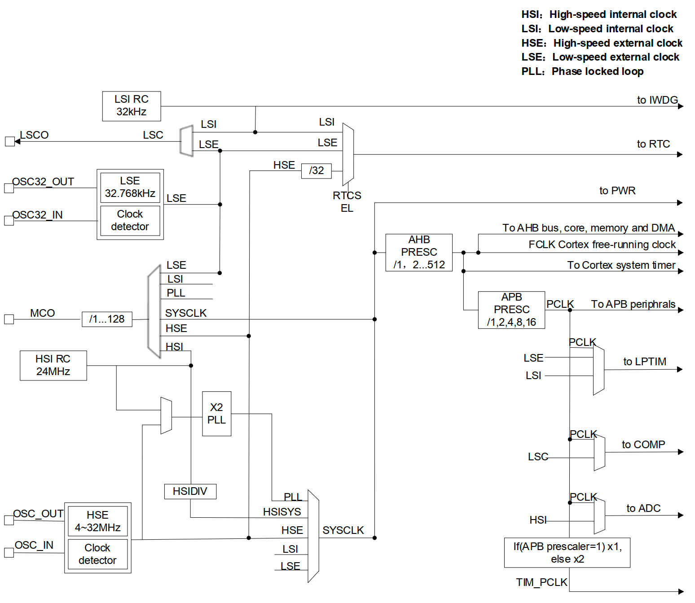

# 时钟配置

时钟是单片机运行指令的节拍，时钟频率代表着单片机CPU或外设运行的速度。PY32F030 支持多个时钟源作为 MCU 的输入时钟，分别是
- HSI，高速内部时钟 (24M)
- HSE，高速外部时钟（4～32MHz）
- LSI，低速内部时钟 (32K) 
- LSE，低速外部时钟 (32.768K)

系统时钟也可使用PLL作为时钟源。PY32F030的内部时钟树如下。



在 嵌入式C 中，配置单片机的时钟通常需要非常小心规划每个时钟频率，且配置正确的时钟节点。在 Rust 驱动中，将时钟的配置严格按照手册逻辑，严格对齐依赖关系。只需要简单对照时钟树框图或代码提示即可配置成功。

## 示例
``` rust
#![no_std]
#![no_main]

use defmt_rtt as _;
use embedded_hal::digital::v2::ToggleableOutputPin;
use panic_probe as _;

use hal::clock::{self, Mco};
use hal::gpio::{Af, PinAF};
use py32f030_hal as hal;
use py32f030_hal::gpio::{Output, PinIoType, PinSpeed};

#[cortex_m_rt::entry]
fn main() -> ! {
    defmt::println!("examples: clock");
    let p = hal::init(Default::default());
    let gpioa = p.GPIOA.split();

    let _mco_pin = Af::new(
        gpioa.PA1,
        PinAF::AF15,
        PinSpeed::VeryHigh,
        PinIoType::PullUp,
    );
    Mco::select(clock::McoSelect::SysClk, clock::McoDIV::DIV1);

    let mut led = Output::new(gpioa.PA11, PinIoType::PullUp, PinSpeed::VeryHigh);

    cortex_m::asm::delay(1000 * 1000 * 5);
    // let _sysclk = clock::SysClock::<clock::HSIDiv<1>>::config().unwrap();
    let _sysclk = clock::SysClock::<clock::HSE>::config().unwrap();

    // let _sysclk = clock::SysClock::<clock::PLL<HSE>>::config().unwrap();

    // PA1 输出 16M
    // let _sysclk = clock::SysClock::<clock::PLL<HSI>>::config().unwrap();

    cortex_m::asm::delay(1000 * 1000 * 5);
    defmt::info!("freq: {}MHZ", clock::sys_core_clock() / 1000 / 1000);

    loop {
        cortex_m::asm::delay(1000 * 1000 * 5);

        let _ = led.toggle();
    }
}
```

运行：`cargo r --example clock`

在测试中，可以将内部时钟通过MCO引脚输出，通过示波器查看真实的时钟。