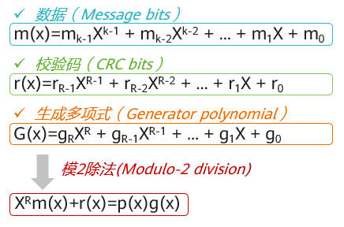
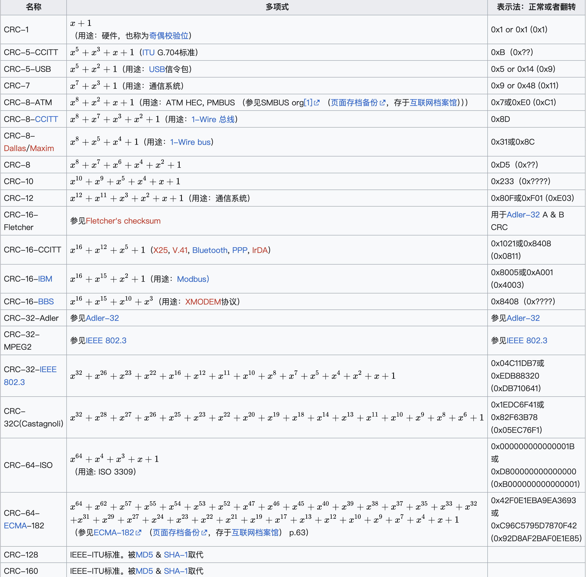

# 什么是 CRC（Cyclic Redundancy Check）？
循环冗余校验CRC（Cyclic Redundancy Check）是数据通信领域常用的一种数据传输检错技术。通过在发送端对数据按照某种算法计算出校验码，并将得到的校验码附在数据帧的后面，一起发送到接收端。接收端对收到的数据和校验码按照相同算法进行验证，以此判断接收到的数据是否正确、完整。

## CRC简介
在多端通信中，数据的交互过程中经常会因为信号干扰或距离过长产生数据丢失或变化，从而导致对方接收到不完整或错误的数据。因此为尽量提高通信的数据的完整率、正确率，在接收数据之前需要对数据进行差错检测，当检测的结果为正确时才接收数据。

差错检测的方式有多种，常见的有奇偶校验、求和校验、CRC校验等。他们的工作原理都是发送端对数据按照某种算法计算出来校验码，将校验码和数据一起发送到接收端，然后接收端进行检验确定数据是否发生变化。

CRC是由W. Wesley Peterson在1961年发表的论文中提出，由于CRC校验在速度、成本、正确率等方面比其他校验方式更具有优势，因此，CRC成为计算机信息、通信领域最为普遍的校验方式。例如在标准的以太帧格式中，最后有4个字节长度的冗余位，用于存储CRC校验的值，这个冗余位又常称为帧检验序列FCS（Frame Check Sequence）。

## CRC是如何计算的？
CRC的思想就是先在要发送的K比特长度的数据后面附加一个R比特长度的校验码，然后生成一个新帧发送给接收端。接收端接收到新帧后，根据收到的数据和校验码来验证接收到的数据是否正确。

当然，这个附加的校验码不是随意添加的，要使所生成的新帧能与发送端和接收端共同选定的某个特定数整除（“模2除法”）。接收端把接收到的新帧除以这个选定的除数。因为在发送数据帧之前就已通过附加一个数，做了“去余”处理（也就已经能整除了），所以结果应该是没有余数。如果有余数，则表明该帧在传输过程中出现了差错。

在K比特数据后面再拼接R比特的校验码，整个编码长度为N比特，这种编码也叫(N,K)码。对于一个给定的(N,K)码，可以证明存在一个最高次幂为N-K=R的多项式g(x)，根据g(x)可以生成R比特的校验码。其算法是以GF(2)多项式算术为数学基础的，原理如下图所示。


CRC计算公式
g(x)叫做这个校验码的生成多项式。不同的CRC生成多项式，其检错能力是不同的。要使用R位校验码，生成多项式的次幂应为R。以下为常见的一些标准多项式。


这些多项式的值便是模2除法的除数。而根据这个除数获得校验码并进行校验的原理可以分为以下几个步骤：

发送端、接收端在通信前，约定好除数P，也就是前面说的多项式的值。P应该是R+1位长度；
发送端首先在原来的K位数据后面加R个0，相当于原来的数据左移了R位；
然后进行模2除法运算（其实就是异或XOR运算），将加0之后的K+R位的数除以P，循环计算，直到余数的阶数小于R，这个余数就是附加的校验码，如果长度不足R位需要在前面加0补齐；
发送端将R位校验码附加在原数据后面发送给接收方；
接收方接收到数据后，将数据以模2除法方式除以除数P。如果没有余数，说明在传输过程中没有出现错误，否则说明有错误。
下面以一个简单示例来展示CRC的计算过程：

以g(x)为CRC-4=X4+X+1为例，此时除数P=10011。假设源数据M为10110011。

在发送端将M左移4位，然后除以P。

计算得到的余数就是0100，也就是CRC校验码。将0100附加到原始数据帧10110011后，组成新帧101100110100发送给接收端。接收端接收到该帧后，会用该帧去除以上面选定的除数P，验证余数是否为0，如果为0，则表示数据在传输过程中没有出现差错。


PY32F030 内置的 CRC 外设采用 `CRC32` 多项式作为公式。


## 示例：`examples/crc.rs`
``` rust
#![no_std]
#![no_main]

use embassy_executor::Spawner;
use py32f030_hal::crc::Crc;
use py32f030_hal::{self as hal};

use {defmt_rtt as _, panic_probe as _};

#[embassy_executor::main]
async fn main(_spawner: Spawner) {
    let p = hal::init(Default::default());

    let crc = Crc::new(p.CRC);

    let buf1 = [
        0x00001021, 0x20423063, 0x408450a5, 0x60c670e7, 0x9129a14a, 0xb16bc18c, 0xd1ade1ce,
        0xf1ef1231, 0x32732252, 0x52b54294, 0x72f762d6, 0x93398318, 0xa35ad3bd, 0xc39cf3ff,
        0xe3de2462, 0x34430420, 0x64e674c7, 0x44a45485, 0xa56ab54b, 0x85289509, 0xf5cfc5ac,
        0xd58d3653, 0x26721611, 0x063076d7, 0x569546b4, 0xb75ba77a, 0x97198738, 0xf7dfe7fe,
        0xc7bc48c4, 0x58e56886, 0x78a70840, 0x18612802, 0xc9ccd9ed, 0xe98ef9af, 0x89489969,
        0xa90ab92b, 0x4ad47ab7, 0x6a961a71, 0x0a503a33, 0x2a12dbfd, 0xfbbfeb9e, 0x9b798b58,
        0xbb3bab1a, 0x6ca67c87, 0x5cc52c22, 0x3c030c60, 0x1c41edae, 0xfd8fcdec, 0xad2abd0b,
        0x8d689d49, 0x7e976eb6, 0x5ed54ef4, 0x2e321e51, 0x0e70ff9f, 0xefbedfdd, 0xcffcbf1b,
        0x9f598f78, 0x918881a9, 0xb1caa1eb, 0xd10cc12d, 0xe16f1080, 0x00a130c2, 0x20e35004,
        0x40257046, 0x83b99398, 0xa3fbb3da, 0xc33dd31c, 0xe37ff35e, 0x129022f3, 0x32d24235,
        0x52146277, 0x7256b5ea, 0x95a88589, 0xf56ee54f, 0xd52cc50d, 0x34e224c3, 0x04817466,
        0x64475424, 0x4405a7db, 0xb7fa8799, 0xe75ff77e, 0xc71dd73c, 0x26d336f2, 0x069116b0,
        0x76764615, 0x5634d94c, 0xc96df90e, 0xe92f99c8, 0xb98aa9ab, 0x58444865, 0x78066827,
        0x18c008e1, 0x28a3cb7d, 0xdb5ceb3f, 0xfb1e8bf9, 0x9bd8abbb, 0x4a755a54, 0x6a377a16,
        0x0af11ad0, 0x2ab33a92, 0xed0fdd6c, 0xcd4dbdaa, 0xad8b9de8, 0x8dc97c26, 0x5c644c45,
        0x3ca22c83, 0x1ce00cc1, 0xef1fff3e, 0xdf7caf9b, 0xbfba8fd9, 0x9ff86e17, 0x7e364e55,
        0x2e933eb2, 0x0ed11ef0,
    ];

    assert_eq!(crc.calculate(&buf1), 0x379E9F06);

    defmt::info!("{:x}", crc.calculate(&buf1));
    crc.reset();

    crc.accumulat(&buf1[0..10]);
    let rst = crc.accumulat(&buf1[10..]);
    defmt::info!("{:x}", rst);

    loop {
        cortex_m::asm::wfe();
    }
}

```