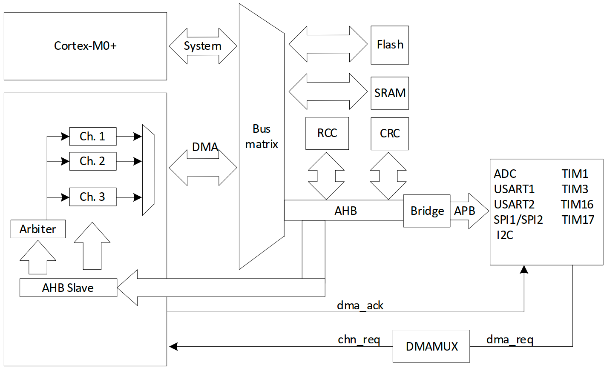

# DMA

直接存储器存取(DMA)用来提供在外设和存储器之间或者存储器和存储器之间的高速数据传输。无须 CPU干预，数据可以通过 DMA 快速地移动，节省了 CPU 的资源,进行其他操作。DMA 控制器有 3 条 DMA 通道，每条通道负责管理来自 1 个或者多个外设对存储器访问的请求。 

DMA 控制器包括处理 DMA 请求的仲裁器，用于处理各个 DMA 请求的优先级。



PY32F030 的DMA 内部有3个独立的通道，可用于外设与存储器或存储器与存储器之间的高速数据传输，可配置各通道的优先级。

## 示例

### 存储器与存储器：`examples/dma_mem2mem.rs`
``` rust
#![no_std]
#![no_main]

use defmt::Debug2Format;
use hal::dma::{AnyDma, Burst, Priorities, RepeatMode};
use py32f030_hal::{self as hal, dma::Config, mode::Blocking};

use {defmt_rtt as _, panic_probe as _};

#[cortex_m_rt::entry]
fn main() -> ! {
    let p = hal::init(Default::default());
    defmt::info!("embassy_dma_mem2mem example!");

    let mut src: [u32; 4] = [1, 2, 3, 4];
    let mut dst: [u32; 4] = [0; 4];

    let mut dma: AnyDma<_, Blocking> = AnyDma::new(p.DMA);

    let [mut channel1, _, _] = dma.split();
    channel1.config(Config::new_mem2mem(
        src.as_mut_ptr() as u32,
        true,
        dst.as_mut_ptr() as u32,
        true,
        Priorities::Low,
        RepeatMode::OneTime(src.len() as u16),
        Burst::World,
    ));

    channel1.start();

    let rst = channel1.wait_complet();

    defmt::info!("rst: {:?}", Debug2Format(&rst));
    defmt::info!("src: {} ", src);
    defmt::info!("dst: {} ", dst);

    loop {
        cortex_m::asm::wfe();
    }
}

```
