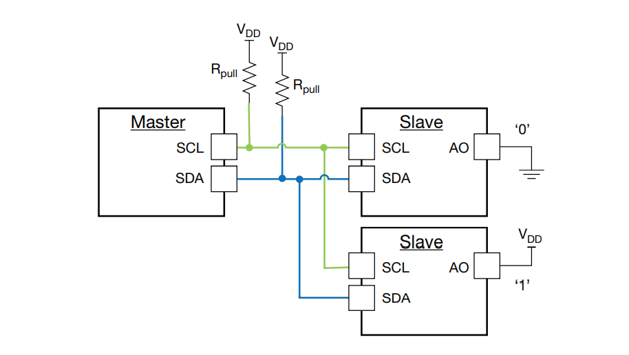
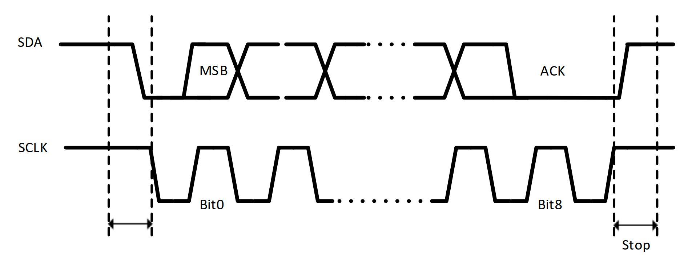

# I2C

I2C(Inter-IC Communication. IIC), 也是使用非常广泛的同步串行总线, 支持多控制器，多从设备的总线，只需要 SCL 和 CLK两根线即可，与 UART 串口不同的是， I2C 总线支持总线仲裁，解决多主设备同时发送时数据冲突问题，同时主从设备通信更稳定，因为使用时钟线 CLK 用于同步收发双方的速度。

I2C 总线支持一个主机并联多个从设备。通常使用拓扑如下：


I2C 总线常用于板内设备通信，如M应用与CU与传感器、控制电路、屏幕等设备之间的通信。
各从设备都具备一个 I2C 地址，且同一并联的总线不能有相同的地址。I2C 的时钟与数据线有着严格的时序要求。



- 起始信号：SCL保持高，SDA下降沿
- 停止信号：SCL保持高，SDA上升沿
- 采集数据：SDA稳定，SCL上升沿
- ACK信号：接收方拉低SDA后，主机在SCL上升沿接收到低电平
- NACK信号：

## 示例:`examples/i2c_master_block.rs`
``` rust
#![no_std]
#![no_main]

use defmt::Debug2Format;
// use embedded_io::Write;
use embedded_hal::digital::v2::OutputPin;
use hal::delay;
use hal::i2c::{AnyI2c, Config};
use py32f030_hal::delay::delay_ms;
use py32f030_hal::gpio::{Output, PinIoType, PinSpeed};
use py32f030_hal::{self as hal, mode::Blocking};

use {defmt_rtt as _, panic_probe as _};

#[cortex_m_rt::entry]
fn main() -> ! {
    defmt::info!("i2c start...");
    let p = hal::init(Default::default());

    let gpioa = p.GPIOA.split();

    let mut lcd_rst = Output::new(gpioa.PA4, PinIoType::PullUp, PinSpeed::Low);
    let _ = lcd_rst.set_low();
    delay_ms(200);
    let _ = lcd_rst.set_high();

    let sda = gpioa.PA2;
    let scl = gpioa.PA3;
    let config = Config::default().speed(200_000);
    // 配置 200K的速度
    let i2c1 = AnyI2c::<_, Blocking>::new(p.I2C, scl, sda, config).unwrap();
    let master = i2c1.as_master();

    let buf: [u8; 10] = [1, 2, 3, 4, 5, 6, 7, 8, 9, 0];
    let mut r_buf: [u8; 2] = [0; 2];
    let mut cnt = 0;
    const SLAVE_DEVICE_ADDRESS: u8 = 0x3c;
    loop {
        // write from i2c
        let rst = master.write_block(SLAVE_DEVICE_ADDRESS, &buf);

        defmt::info!("write rst: {:?} ", Debug2Format(&rst));
        if rst.is_err() {
            // master.clear_errors()
        }

        // read from i2c
        let rst = master.read_block(SLAVE_DEVICE_ADDRESS, &mut r_buf);
        defmt::info!("read rst: {:?} ", Debug2Format(&rst));

        delay::delay_ms(1000);
        defmt::info!("{}", cnt);
        cnt += 1;
    }
}
```

## 参考
- [主仓库](https://github.com/hysonglet/py32f030-hal)
- [原理图](https://github.com/hysonglet/Py32F030_CrabBoard_Hardware)
- [教程](https://hysonglet.github.io/rust-embedded-start/)
- [I2C总线该怎么用？看完你就会了](https://mp.weixin.qq.com/s/IeL77NTyVdTdkcNtqjjFPA)
- [I2C总线协议](https://zhenhuizhang.tk/post/dian-lu-i2c-zong-xian-xie-yi/)
- [I2C](https://learn.sparkfun.com/tutorials/i2c/all)