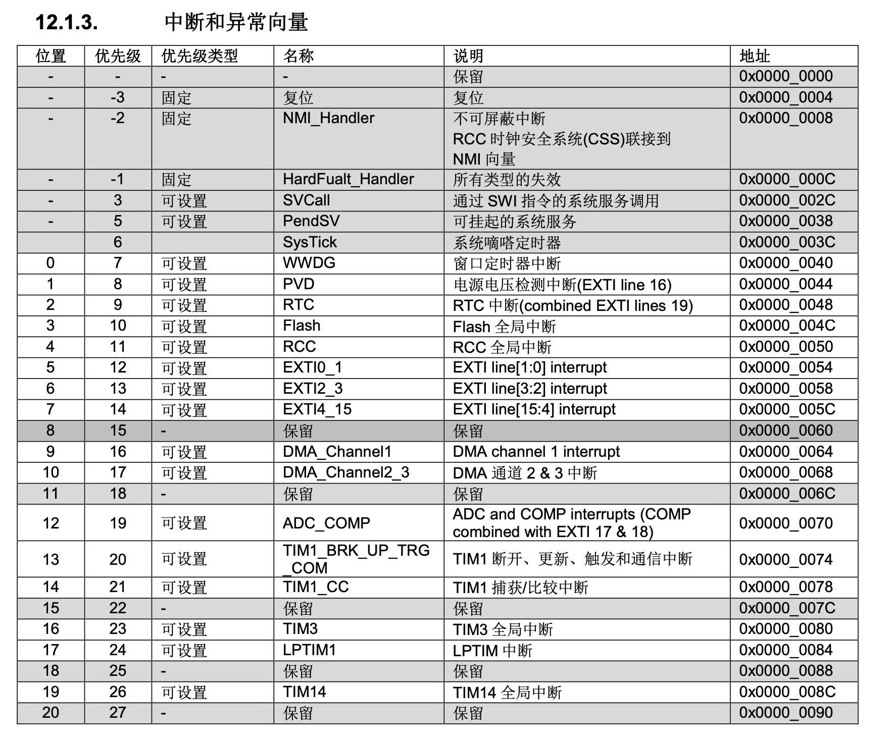

# 中断详解

在 CPU 在正常执行指令序列时，当外部源（外设信号或GPIO引脚）或内部（指令异常、总线错误等）触发 CPU 暂停当前工作，跳转到相应的服务函数入口执行紧急任务。

对于每个中断类型都需要指定一个中断处理函数，这些中断处理函数的地址组成中断向量表，当发生中断时，如果中断使能，CPU 会自动跳转的相应的中断处理函数去执行中断处理任务。

## Py32f030 中断
主要特性如下：
- 32 个可屏蔽的中断通道（不包括 16 个 CPU 的中断）
- 4 个可编程的优先级（2 位中断优先级）



## 代码实现
Py32f030 的内核为 Cortex-M0+ 内核，内核的标准中断抽象在 [cortex-m-rt](https://docs.rs/cortex-m-rt/)，这部分的中断抽象实现在文件：`src/lib.rs`
``` rust
/* Exceptions */
#[doc(hidden)]
pub enum Exception {
    NonMaskableInt,

    // Not overridable
    // HardFault,
    #[cfg(not(armv6m))]
    MemoryManagement,

    #[cfg(not(armv6m))]
    BusFault,

    #[cfg(not(armv6m))]
    UsageFault,

    #[cfg(armv8m)]
    SecureFault,

    SVCall,

    #[cfg(not(armv6m))]
    DebugMonitor,

    PendSV,

    SysTick,
}

#[doc(hidden)]
pub use self::Exception as exception;

extern "C" {
    fn Reset() -> !;

    fn NonMaskableInt();

    fn HardFaultTrampoline();

    #[cfg(not(armv6m))]
    fn MemoryManagement();

    #[cfg(not(armv6m))]
    fn BusFault();

    #[cfg(not(armv6m))]
    fn UsageFault();

    #[cfg(armv8m)]
    fn SecureFault();

    fn SVCall();

    #[cfg(not(armv6m))]
    fn DebugMonitor();

    fn PendSV();

    fn SysTick();
}

#[doc(hidden)]
pub union Vector {
    handler: unsafe extern "C" fn(),
    reserved: usize,
}

#[doc(hidden)]
#[cfg_attr(cortex_m, link_section = ".vector_table.exceptions")]
#[no_mangle]
pub static __EXCEPTIONS: [Vector; 14] = [
    // Exception 2: Non Maskable Interrupt.
    Vector {
        handler: NonMaskableInt,
    },
    // Exception 3: Hard Fault Interrupt.
    Vector {
        handler: HardFaultTrampoline,
    },
    // Exception 4: Memory Management Interrupt [not on Cortex-M0 variants].
    #[cfg(not(armv6m))]
    Vector {
        handler: MemoryManagement,
    },
    #[cfg(armv6m)]
    Vector { reserved: 0 },
    // Exception 5: Bus Fault Interrupt [not on Cortex-M0 variants].
    #[cfg(not(armv6m))]
    Vector { handler: BusFault },
    #[cfg(armv6m)]
    Vector { reserved: 0 },
    // Exception 6: Usage Fault Interrupt [not on Cortex-M0 variants].
    #[cfg(not(armv6m))]
    Vector {
        handler: UsageFault,
    },
    #[cfg(armv6m)]
    Vector { reserved: 0 },
    // Exception 7: Secure Fault Interrupt [only on Armv8-M].
    #[cfg(armv8m)]
    Vector {
        handler: SecureFault,
    },
    #[cfg(not(armv8m))]
    Vector { reserved: 0 },
    // 8-10: Reserved
    Vector { reserved: 0 },
    Vector { reserved: 0 },
    Vector { reserved: 0 },
    // Exception 11: SV Call Interrupt.
    Vector { handler: SVCall },
    // Exception 12: Debug Monitor Interrupt [not on Cortex-M0 variants].
    #[cfg(not(armv6m))]
    Vector {
        handler: DebugMonitor,
    },
    #[cfg(armv6m)]
    Vector { reserved: 0 },
    // 13: Reserved
    Vector { reserved: 0 },
    // Exception 14: Pend SV Interrupt [not on Cortex-M0 variants].
    Vector { handler: PendSV },
    // Exception 15: System Tick Interrupt.
    Vector { handler: SysTick },
];

// If we are not targeting a specific device we bind all the potential device specific interrupts
// to the default handler
#[cfg(all(any(not(feature = "device"), test), not(armv6m)))]
#[doc(hidden)]
#[cfg_attr(cortex_m, link_section = ".vector_table.interrupts")]
#[no_mangle]
pub static __INTERRUPTS: [unsafe extern "C" fn(); 240] = [{
    extern "C" {
        fn DefaultHandler();
    }

    DefaultHandler
}; 240];

// ARMv6-M can only have a maximum of 32 device specific interrupts
#[cfg(all(not(feature = "device"), armv6m))]
#[doc(hidden)]
#[link_section = ".vector_table.interrupts"]
#[no_mangle]
pub static __INTERRUPTS: [unsafe extern "C" fn(); 32] = [{
    extern "C" {
        fn DefaultHandler();
    }

    DefaultHandler
}; 32];

```

Py32f030 的芯片中断抽象在 [PY32f030xx-pac](https://docs.rs/PY32f030xx-pac) 已经自动实现。

中断向量表的定义在文件：`src/lib.rs +35`
``` rust
#[cfg(feature = "rt")]
extern "C" {
    fn WWDG();
    fn PVD();
    fn RTC();
    fn FLASH();
    fn RCC();
    fn EXTI0_1();
    fn EXTI2_3();
    fn EXTI4_15();
    fn DMA_CHANNEL1();
    fn DMA_CHANNEL2_3();
    fn ADC_COMP();
    fn TIM1_BRK_UP_TRG_COM();
    fn TIM1_CC();
    fn TIM3();
    fn TIM14();
    fn TIM16();
    fn TIM17();
    fn I2C1();
    fn SPI1();
    fn SPI2();
    fn USART1();
    fn USART2();
    fn LED();
}
#[doc(hidden)]
pub union Vector {
    _handler: unsafe extern "C" fn(),
    _reserved: u32,
}
#[cfg(feature = "rt")]
#[doc(hidden)]
#[link_section = ".vector_table.interrupts"]
#[no_mangle]
pub static __INTERRUPTS: [Vector; 31] = [
    Vector { _handler: WWDG },
    Vector { _handler: PVD },
    Vector { _handler: RTC },
    Vector { _handler: FLASH },
    Vector { _handler: RCC },
    Vector { _handler: EXTI0_1 },
    Vector { _handler: EXTI2_3 },
    Vector { _handler: EXTI4_15 },
    Vector { _reserved: 0 },
    Vector {
        _handler: DMA_CHANNEL1,
    },
    Vector {
        _handler: DMA_CHANNEL2_3,
    },
    Vector { _reserved: 0 },
    Vector { _handler: ADC_COMP },
    Vector {
        _handler: TIM1_BRK_UP_TRG_COM,
    },
    Vector { _handler: TIM1_CC },
    Vector { _reserved: 0 },
    Vector { _handler: TIM3 },
    Vector { _reserved: 0 },
    Vector { _reserved: 0 },
    Vector { _handler: TIM14 },
    Vector { _reserved: 0 },
    Vector { _handler: TIM16 },
    Vector { _handler: TIM17 },
    Vector { _handler: I2C1 },
    Vector { _reserved: 0 },
    Vector { _handler: SPI1 },
    Vector { _handler: SPI2 },
    Vector { _handler: USART1 },
    Vector { _handler: USART2 },
    Vector { _reserved: 0 },
    Vector { _handler: LED },
];
#[doc = r"Enumeration of all the interrupts."]
#[derive(Copy, Clone, Debug, PartialEq, Eq)]
#[repr(u16)]
pub enum Interrupt {
    #[doc = "0 - Window WatchDog Interrupt"]
    WWDG = 0,
    #[doc = "1 - PVD Interrupt through EXTI Lines 16"]
    PVD = 1,
    #[doc = "2 - RTC Interrupt through EXTI Lines 19"]
    RTC = 2,
    #[doc = "3 - FLASH global Interrupt"]
    FLASH = 3,
    #[doc = "4 - RCC global Interrupt"]
    RCC = 4,
    #[doc = "5 - EXTI Line 0 and 1 Interrupt"]
    EXTI0_1 = 5,
    #[doc = "6 - EXTI Line 2 and 3 Interrupt"]
    EXTI2_3 = 6,
    #[doc = "7 - EXTI Line 4 to 15 Interrupt"]
    EXTI4_15 = 7,
    #[doc = "9 - DMA Channel 1 Interrupt"]
    DMA_CHANNEL1 = 9,
    #[doc = "10 - DMA Channel 2 and Channel 3 Interrupt"]
    DMA_CHANNEL2_3 = 10,
    #[doc = "12 - ADC and COMP Interrupt through EXTI Lines 17 and 18"]
    ADC_COMP = 12,
    #[doc = "13 - TIM1 Break, Update, Trigger and Commutation Interrupt"]
    TIM1_BRK_UP_TRG_COM = 13,
    #[doc = "14 - TIM1 Capture Compare Interrupt"]
    TIM1_CC = 14,
    #[doc = "16 - TIM3 global Interrupt"]
    TIM3 = 16,
    #[doc = "19 - TIM14 global Interrupt"]
    TIM14 = 19,
    #[doc = "21 - TIM16 global Interrupt"]
    TIM16 = 21,
    #[doc = "22 - TIM17 global Interrupt"]
    TIM17 = 22,
    #[doc = "23 - I2C1 global Interrupt"]
    I2C1 = 23,
    #[doc = "25 - SPI1 global Interrupt"]
    SPI1 = 25,
    #[doc = "26 - SPI2 global Interrupt"]
    SPI2 = 26,
    #[doc = "27 - USART1 global Interrupt"]
    USART1 = 27,
    #[doc = "28 - USART2 global Interrupt"]
    USART2 = 28,
    #[doc = "30 - LED global Interrupt"]
    LED = 30,
}
unsafe impl cortex_m::interrupt::InterruptNumber for Interrupt {
    #[inline(always)]
    fn number(self) -> u16 {
        self as u16
    }
}
```

## 中断服务函数的实现
尽管 `PY32f030xx-pac` crate 已经对所有的中断进行了抽象，但对于中断服务函数的实现只做了默认的空函数，如果需要重写某个中断服务函数，也非常简单， 与嵌入式 C 的方式原理一样。中断函数名必须与中断向量表中预定的函数名保持一致，且添加属性 `#[interrupt]`。如下所示展示串口1 和串口2的中断服务函数：

``` rust
use crate::pac::interrupt;

#[interrupt]
fn USART1() {
    critical_section::with(|cs| unsafe {
        EventFuture::<USART1>::on_interrupt(cs, Id::USART1 as usize)
    })
}

#[interrupt]
fn USART2() {
    critical_section::with(|cs| unsafe {
        EventFuture::<USART2>::on_interrupt(cs, Id::USART2 as usize)
    })
}
```
