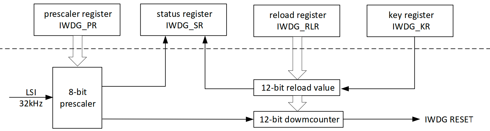

# 独立看门狗

独立看门狗外设常用来检测系统是否死机、系统卡死、指令跑飞等异常的场景。PY32F030 的独立看门狗是一个独立的 12 位向下计数器。由 LSI 提供时钟。喂狗周期最长达 32 秒。



## 示例：`examples/embassy_iwdg.rs`
``` rust
#![no_std]
#![no_main]

use py32f030_hal as hal;
use {defmt_rtt as _, panic_probe as _};

use embassy_executor::Spawner;
use embassy_time::Timer;
use hal::iwdg::{Config, IWdg};

#[embassy_executor::main]
async fn main(_spawner: Spawner) {
    let p = hal::init(Default::default());
    defmt::info!("Hello World!");

    let config: Config = Default::default();
    defmt::info!("iwdg timeout: {}us", config.timeout_us());
    let iwdg = IWdg::new(p.IWdg, config);
    iwdg.start();

    let mut cnt: u32 = 0;
    loop {
        defmt::info!("time {} ", cnt);
        iwdg.feed();
        cnt += 1;
        // 10 秒内喂狗
        if cnt <= 10 {
            Timer::after_millis(1000).await;
        } else {
            // 10秒后等待喂狗超时
            Timer::after_secs(30).await;
        }
    }
}
```

运行：`cargo r --example embassy_iwdg --features embassy`