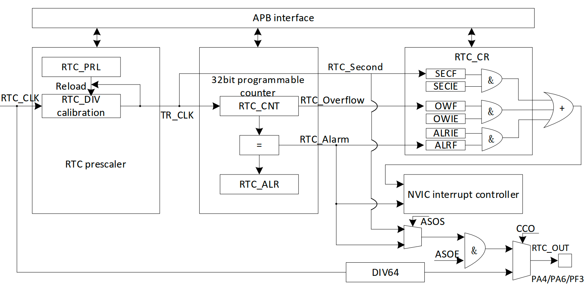

# RTC 
实时时钟（RTC）也是一个独立的定时器外设，PY32F030 的RTC外设位 32 位的可编程计数器，可用于计数、时间测量等场景。

其 RTC 模块可以选择三种时钟源：
- HSE/128
- LSE
- LSI

可配置3个可屏蔽的中断：
- 闹钟中断
- 秒中断
- 溢出中断



## 示例1: `examples/rtc_block.rs`
``` rust
///! #  RTC demo 
///  该代码实现了一个RTC定时的功能
#![no_std]
#![no_main]

use hal::rtc::AnyRtc;
use py32f030_hal::{self as hal, mode::Blocking};

// use panic_halt as _;
use {defmt_rtt as _, panic_probe as _};

#[cortex_m_rt::entry]
fn main() -> ! {
    let p = hal::init(Default::default());

    let rtc: AnyRtc<_, Blocking> = AnyRtc::new(p.RTC, Default::default()).unwrap();

    loop {
        defmt::info!("{}", rtc.read());
        rtc.wait_block(5);
    }
}
```

运行：`运行：`cargo r --example rtc_block`

## 示例2: `examples/embassy_rtc.rs`
异步多任务方式使用 RTC 外设
``` rust
#![no_std]
#![no_main]

use embassy_futures::select;
use py32f030_hal::mode::Async;
use py32f030_hal::{self as hal};

use embassy_executor::Spawner;
use embassy_time::Timer;
use hal::rtc::AnyRtc;

// use panic_halt as _;
use {defmt_rtt as _, panic_probe as _};

#[embassy_executor::task]
async fn run() {
    let mut cnt: u32 = 0;
    loop {
        defmt::info!("task run {} ", cnt);
        cnt += 2;
        Timer::after_secs(2).await;
    }
}

#[embassy_executor::main]
async fn main(spawner: Spawner) {
    let p = hal::init(Default::default());

    let rtc: AnyRtc<_, Async> = AnyRtc::new(p.RTC, Default::default()).unwrap();

    defmt::info!("start: {}", rtc.read());
    spawner.spawn(run()).unwrap();

    loop {
        rtc.wait_alarm(3).await;
        defmt::info!("rtc: {}", rtc.read());

        rtc.wait_second().await;
        defmt::info!("rtc: {}", rtc.read());

        select::select(rtc.wait_alarm(3), rtc.wait_second()).await;
        defmt::info!("rtc: {}", rtc.read());
    }
}
```

运行：`cargo r --example embassy_rtc --features embassy`