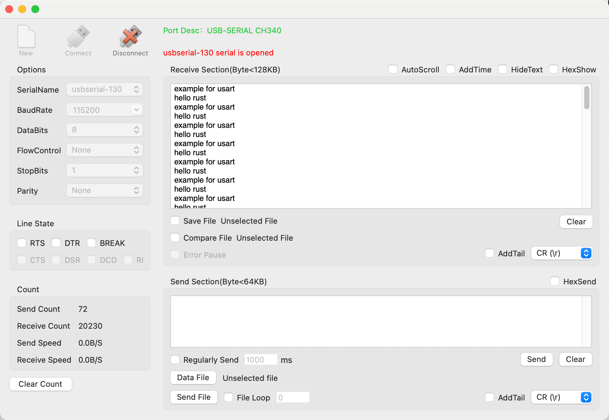

# 串口通信

串口(Serial)作为 MCU 常用的通信外设，应用非常广泛，如日志打印、通信交互、控制等。通常我们使用异步串口（UART）接口通信，通常只有 RX，TX两根线即可完成接收和发送的功能。

串口通信的底层逻辑非常容易理解，就像是我们日常两人谈话或多人谈话交流一样，我们想要表达一些意思时，需要一个字一个字念出来，在场的所有人都能听到，同时如果有其他人同时说话，可能接听者就容易误解。同时，不同的人说话速度、连读可能不一样，因此为了提高交流效率，要求大家都用同样的语速和语言交流。

对于串口外设来说，有以下参数必须需要设置：
- 波特率
- 位数
- 停止位
- 校验位

通信双方必须配置一致才能正常通信。

由于计算机的发展，现在常用的笔记本电脑或台式机已经不再附带串口，但可使用USB转串口工具来使用串口设备。在本开发板中自带一个USB转串口的电路，电脑使用 Type-C 线连接即可使用串口功能。本开发板的串口的电路如下：


该电路可用于串口下载程序，也可在单片机程序中作为串口与电脑进行通信。

## 示例: `examples/uart.rs`
``` rust
#![no_std]
#![no_main]

use embedded_io::Write;
use hal::usart::AnyUsart;
use heapless::String;
use py32f030_hal as hal;

use {defmt_rtt as _, panic_probe as _};

#[cortex_m_rt::entry]
fn main() -> ! {
    let p = hal::init(Default::default());
    let gpioa = p.GPIOA.split();

    let tx = gpioa.PA9;
    let rx = gpioa.PA10;

    let usart = AnyUsart::new(p.USART1, Some(rx), Some(tx), None, None, Default::default());

    let (_, mut tx) = usart.split();

    defmt::info!("usart start...");
    let buf: String<20> = "hello rust\r\n".into();
    loop {
        // 使用标准接口来发送串口数据
        let _ = write!(tx, "example for usart\r\n");

        // 使用自定义的驱动接口发送串口数据
        let _ = tx.write(buf.as_bytes());

        defmt::info!("send: {} ", buf.as_bytes());
        cortex_m::asm::delay(1000 * 1000 * 10);
    }
}
```

## 测试如下
``` bash
➜  py32f030-hal git:(main) ✗ cargo r --example uart
warning: unused manifest key: dependencies.embedded-io-async.option
    Finished `dev` profile [optimized + debuginfo] target(s) in 0.03s
     Running `probe-rs run --chip PY32F030x8 target/thumbv6m-none-eabi/debug/examples/uart`
      Erasing ✔ [00:00:00] [########################################################################] 12.00 KiB/12.00 KiB @ 84.02 KiB/s (eta 0s )
  Programming ✔ [00:00:02] [#########################################################################] 11.25 KiB/11.25 KiB @ 3.91 KiB/s (eta 0s )    Finished in 3.062s
INFO  usart start...
└─ uart::__cortex_m_rt_main @ examples/uart.rs:23  
INFO  send: [104, 101, 108, 108, 111, 32, 114, 117, 115, 116, 13, 10] 
└─ uart::__cortex_m_rt_main @ examples/uart.rs:32  
INFO  send: [104, 101, 108, 108, 111, 32, 114, 117, 115, 116, 13, 10] 
└─ uart::__cortex_m_rt_main @ examples/uart.rs:32  
INFO  send: [104, 101, 108, 108, 111, 32, 114, 117, 115, 116, 13, 10] 
└─ uart::__cortex_m_rt_main @ examples/uart.rs:32  
INFO  send: [104, 101, 108, 108, 111, 32, 114, 117, 115, 116, 13, 10] 
└─ uart::__cortex_m_rt_main @ examples/uart.rs:32  
INFO  send: [104, 101, 108, 108, 111, 32, 114, 117, 115, 116, 13, 10] 
└─ uart::__cortex_m_rt_main @ examples/uart.rs:32  
^C%                                                                                                                          
```
电脑主机端需要串口工具用于显示单片机发送的信息。如果没有安装串口工具，可以参考 [串口工具](../daily_tools/serial_tools.md)



在测试代码的串口配置中，使用了驱动默认的配置，`Default::default()`,在Vscode 点击代码可以进入驱动层看到如下：
``` rust
/// 串口的综合配置结构体
#[derive(Default)]
pub struct Config {
    pub baud_rate: BaudRate,
    pub stop_bit: StopBits,
    pub word_len: WordLen,
    pub parity: Parity,
    // pub hw_flow_ctrl: HwFlowCtrl,
    pub data_bits: DataBits,
    pub over_sampling: OverSampling,
    // pub mode: T,
}

/// 串口的波特率定义
#[derive(Default)]
pub enum BaudRate {
    // Auto = 0,
    Bps300 = 300,
    Bps1200 = 1200,
    Bps2400 = 2400,
    Bps4800 = 4800,
    Bps9600 = 9600,
    Bps1440 = 1440,
    Bps19200 = 19200,
    Bps28800 = 28800,
    Bps38400 = 38400,
    Bps57600 = 57600,
    Bps74880 = 74880,
    #[default]
    Bps115200 = 115200,
    Bps230400 = 230400,
}

/// 串口数据长度
#[derive(Default)]
pub enum WordLen {
    #[default]
    WordLen8 = 0,
    WordLen9 = 1,
}
...
```

在各个配置中，使用宏`#[derive(Default)]` 声明使用各个定义默认枚举所标记的值。

## 其他示例：`examples/embassy_uart.rs`

以下展示使用异步接口来与主机端通信，展示接收和发送数据。以下代码也可轻松改造成接收和发送使用不同的任务去运行。
``` rust
#![no_std]
#![no_main]

// use embedded_io::Write;
use defmt::Debug2Format;
use hal::usart::AnyUsart;
use heapless::String;
use py32f030_hal::{self as hal, mode::Async};

use {defmt_rtt as _, panic_probe as _};

use embassy_executor::Spawner;
use embassy_time::Timer;

#[embassy_executor::main]
async fn main(_spawner: Spawner) {
    let p = hal::init(Default::default());

    let gpioa = p.GPIOA.split();
    let rx = gpioa.PA10;
    let tx = gpioa.PA9;

    let usart: AnyUsart<_, Async> =
        AnyUsart::new(p.USART1, Some(rx), Some(tx), None, None, Default::default());

    let (mut rx, mut tx) = usart.split();

    defmt::info!("usart start...");
    let buf: String<20> = "hello rust\r\n".into();

    let mut rx_buf: [u8; 10] = [0; 10];

    loop {
        // 使用标准接口来发送串口数据
        // let _ = write!(tx, "example for usart\r\n");
        let rst = rx.read(&mut rx_buf).await;
        // let rst = rx.read_with_idle(&mut rx_buf).await;
        // defmt::info!("recv: rst: {:?} {:x}", Debug2Format(&rst), rx_buf);
        // 使用自定义的驱动接口发送串口数据
        let rst = tx.write(buf.as_bytes()).await;

        defmt::info!("send: rst:{} {:x} ", Debug2Format(&rst), buf.as_bytes());
        Timer::after_secs(1).await;
    }
}
```

运行：`cargo r --example embassy_uart --features embassy`