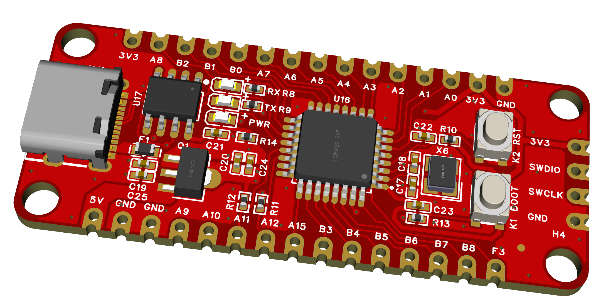

# 环境
## Rust 编译环境
Rust 可以跨平台运行，支持 Windows/Linux/Mac 等主流系统。笔者推荐在 Mac或Linux 下学习和开发，效率更高。本书也主要介绍在 Mac/Linux 嵌入式常用工具和实践习惯。

Rust 提供了非常简单的安装命令, 详细可以参考：[Rust 官方入门手册](https://doc.rust-lang.org/book/)
详细请参考： [Installation - The Rust Programming Language (rust-lang.org)](https://doc.rust-lang.org/book/ch01-01-installation.html)
#### Mac/Linux
```bash
curl --proto '=https' --tlsv1.2 -sSf https://sh.rustup.rs | sh
```
#### [Windows](https://static.rust-lang.org/rustup/dist/i686-pc-windows-gnu/rustup-init.exe)
Windows 下安装稍微麻烦点，具体可参考：[Windows]([MSVC prerequisites - The rustup book (rust-lang.github.io)](https://rust-lang.github.io/rustup/installation/windows-msvc.html))
### 设置 Rust night 版本
Rust 的嵌入式开发环境需要是 nightly 版本
```bash
rustup default nightly
```
## 嵌入式编译工具链
编译嵌入式端的目标文件，需要相应的交叉编译链, 需要手动安装你需要的工具链。Rust 目前已经支持了大部分的交叉编译链，可以通过命令查看目前系统已经支持的交叉编译链：
```bash
rustup target list
```
通常来说，对于不同的芯片厂商，只要芯片内核相同，都可以使用相同的编译链，无需再额外配置hrjk。
### 安装 Cortex-M0 编译工具(Py32_Rust_Dev_1.1)
```bash
rustup target add thumbv6m-none-eabi
```

## Probe-rs
Probe-rs 是一个在Rust 嵌入式开发的常用软件工具，有下载固件到芯片，在线调试固件，打印运行日志、查看芯片内存等功能。
```bash
curl --proto '=https' --tlsv1.2 -LsSf https://github.com/probe-rs/probe-rs/releases/latest/download/probe-rs-tools-installer.sh | sh
```

在完成这一步后，如果顺利的话，你可以跳转到：[快速体验Rust 嵌入式](../develop/fast_start.md)
## 仿真环境

#### TODO
## 主控
本教程使用的开发版为 `Py32_Rust_Dev_1.1`, 所采用的单片机为 `py32f030`, 目前该单片机在国内市场使用较为普遍，同时国外也有相当多的爱好者已经移植了开源的 Arduno 和 Rust。

py32f030 内部比较简单，官方的资料也很完备，比较适合 Rust 嵌入式。该单片机资源如下：
- 内核
	- 32 位 ARM® Cortex® - M0+
	- 最高 48MHz 工作频率
- 存储
	- Flash：64K
	- SRAM：8K
- UART x2
- GPIO x30
- ADC x1
- SPI x2
- Timer x6
- I2C x1
- RTC
- Watchdo
- ......
## 开发版
`Py32_Rust_Dev_1.1` 目前已适配大部分外设的 Rust 驱动，且支持开源的 Arduno、普冉官方的 支持包也可使用。初学者可以在不同的IDE或编译工具上测试，目前支持的框架有：
- Rust
- Arduno
- Keil
- IAR
- EIDE
- GCC
- CMake


## 其他

如果安装环境或编译有报错，你可能需要使用以下命令安装一些工具
- 对于 Mac 系统如果没有安装 GCC 工具链
```bash
xcode-select --install
```
- 对于 Linux 如 ubuntu/Deepin，可以安装一些常用嵌入式工具
```bash
sudo apt-get update
sudo apt-get install build-essential
```


## 附录
[Introduction - The rustup book (rust-lang.github.io)](https://rust-lang.github.io/rustup/index.html)

[The Rust Programming Language - The Rust Programming Language (rust-lang.org)](https://doc.rust-lang.org/beta/book/title-page.html)

[probe-rs - About probe-rs](https://probe.rs/docs/overview/about-probe-rs)