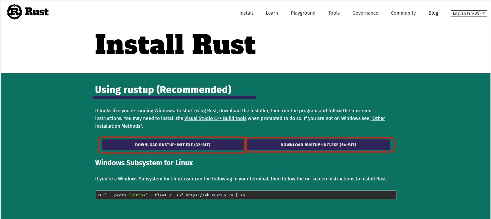
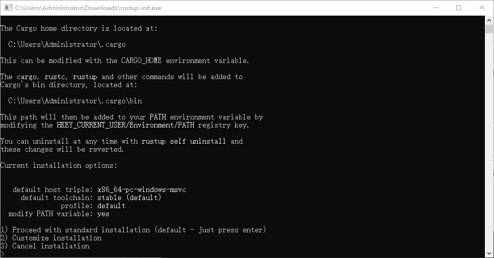
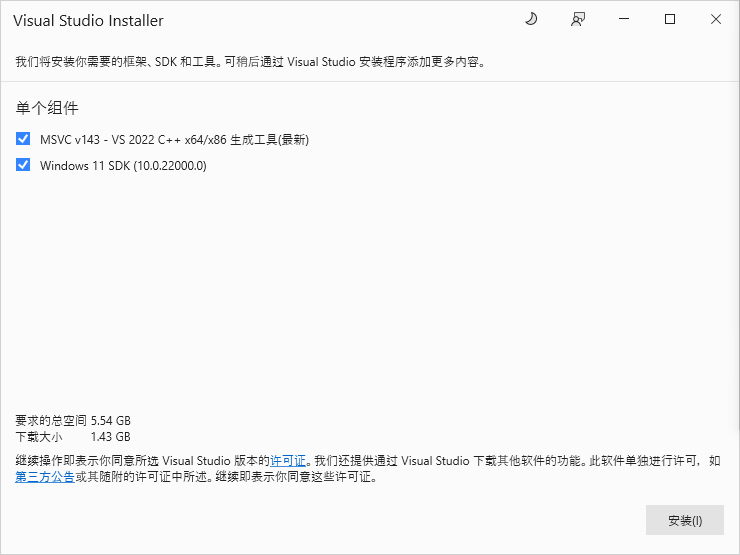
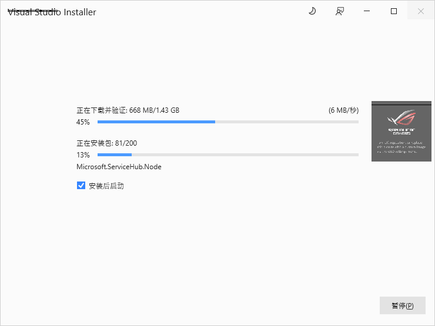

# Windows rust 环境安装

Windows 的Rust 开发环境安装稍微麻烦一点，但是也不难。

## 下载 Rust 安装器
访问 [Rust 官网下载页面](https://www.rust-lang.org/tools/install),点击下载你系统对应的类型下载对应的安装器。

在浏览器的下载器中保存到电脑文件夹。

## 运行安装器
下载完毕后，双击安装器`rustup-init.exe`。在 Rust 安装程序中将看到以下几个选项：

通常选择选项1最为便捷。输入1并回车后，安装器将从网络中下载安装包。因访问外网可能需要耗时10分钟左右。
如果你的电脑没有安装 Visual Studio，安装器将会自动引导安装。选择右下角安装即可。

安装可能比较慢，请耐心等待。

## 附录
- [How to Install Rust on Windows](https://ultahost.com/knowledge-base/install-rust-on-windows/)