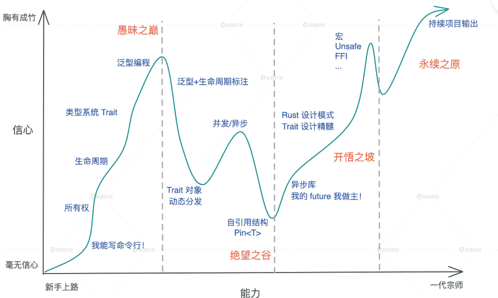

# Rust 嵌入式学习会遇到的挑战

## 语法和基本概念
Rust 的基本语法的入门并不难，如常见的基础变量定义、表达式、判断逻辑、循环逻辑、函数等基础语法基本上与其他语言相似，看过一两个代码后就能习惯 Rust 的语法。因此基础语法并不会有太多障碍。熟悉基础语法后就能编写一些简单命令工具、数据处理工具等，甚至基于一些开源GUI框架编写一些GUI应用。

对于 Rust 高级的知识，如范型、异步、生命周期等概念则需要去深入理解。因此Rust 的学习曲线因人而异，不同背景的人对于 Rust 语言的一些概念理解接受速度不同。比如
- C 语言背景，对堆、栈、生命周期的概念理解可能比较快，但对范型、范式编程、异步Future、零成本抽象等概念理解就稍微难。
- 对于Java：对 trait，范型、错误处理、并发编程的理解比较快，而对堆栈概念理解较弱
- 对于Python来说，模块化编程、类概念有优势。

陈天老师有个总结 Rust 学习曲线图，可以看出 Rust 从入门到精通需要经过三个奔溃时刻，在学习的过程中会发现对 Rust 的掌握不深，不要担心，在嵌入式 Rust 开发中，通常不会要求完全掌握这些 Rust 技能，在日常学习中，通过与编译器不断斗争中，会慢慢加深对这些概念的理解，直至豁然开朗。

## 单片机外设使用
在熟悉 Rust 基础语法后，理解一些常用库的的使用、常用开源 crate 的功能后，就可以开始入门单片机的外设开发。

由于目前嵌入式 Rust的生态并不太丰富，大多数的芯片公司仅提供传统的 C 版本的外设库，可喜的是，目前仍然有一些常见的单片机已经提供了 Rust 的外设库，如 `STM32`、`ESP32`、`GD32`、`NRF52XX` 等。如果你喜欢的单片机没有提供 Rust 外设库，也不用担心，可以自己编写一些外设库，甚至也能使用寄存器级别的开发（请放心，哪怕是寄存器级别的开发，也能保证一定安全和高效， 比同等级别的 C 寄存器级的开发简单更多）。

个人建议可以从已经支持的 Rust 外设库的单片机入门，如`NRF52840`、`STM32`、`rp2040`等。通过调用厂商提供的外设库接口，快速熟悉 Rust 的编程风格、API风格，感受与 C 嵌入式编程的差异。

在拿到单片机开发板后，快速根据库文档搭建编译和下载环境，然后打印`hello world`、点亮 led 灯。这些 Rust 例程跑起来的难度也许比C的例程更加低， 还算比较新手友好。在这个阶段的学习中，你会发现 Rust 外设驱动库的实现方式与C相差非常大，甚至你有很多疑问，不太明白为什么驱动要这样设计，不明白不用太焦虑， 这一阶段你只要能了解外设接口怎么使用即可，能让各个外设正常的工作起来。

在下一个阶段中，你需要去了解`pac`(外设访问控制接口)的使用，制作原理、可以尝试自己利用 `svd2rust` 工具自己制作一个单片机的 pac crate。然后自己尝试通过 `pac` crate 接口来读写芯片的寄存器。然后可以了解单片机是怎么从复位后运行到 Rust 的 main函数，具体你需要去阅读 `cortex-m-rt`和 `cortex-m`。你会发现 Rust 的启动过程竟然与C如此相似，但让一个单片机能运行起来更加简单。如果你很细心，你会继续探究 `build.rs` 代码的功能和编写逻辑，发现 Rust 工具的奥秘，从而能基于这些知识来开启下一个阶段。

在第三个阶段中，你可以尝试自己去编写一些芯片的 Rust 外设驱动库，如果国产的一些芯片，先模仿`NRF52840`、`ESP32`、`STM32`等芯片的库，再次感受驱动设计的思想。开始可以基于一些简单的芯片，如 `Cortex-M0` 内核的芯片，方便快速完成整个芯片驱动库的编写。最后将你编写的Rust 外设库开源出去，通过大家的意见、不断改善和优化，

## 生态
很多人对 Rust 嵌入式的生态持较悲观的态度，认为 Rust 目前没有太多的轮子，需要自己去造。然后我个人在两年的 Rust 嵌入式开发中感受到，目前 Rust 的生态已经足够大部分的工程实践了。在`crate.io` 上有大量优秀的开源 crate 能被工程中所使用。一些单片机的外设库、传感器驱动库、LCD驱动、图形显示框架、IIC/SPI/UART 通信驱动、操作系统等都有比较好的开源 crate， 且质量还不错, 加上 Rust 官方对嵌入式的支持，开放了一些抽象库，让驱动移植变得非常简单便捷，例如传感器库能轻松得在不同单片机中使用。

另外对于书籍文档类资源，Rust 嵌入式也开始有很多详细的公开资料，如ESP32 的 rust 资料非常详细，足以支撑 Rust 嵌入式的学习和开发了。

## 总结
对于这些挑战，其实跨越他们并不困难，一定要有信心去面对，同时也要适当放下困难、不要力图一下理解某些概念，要讲究循序而渐进，自然豁然而开朗。

## 附录
[svd2rust](https://crates.io/crates/svd2rust)

[awesome-embedded-rust](https://github.com/rust-embedded/awesome-embedded-rust)

[cortex_m_quickstart](https://docs.rs/cortex-m-quickstart/0.3.1/cortex_m_quickstart)

[Embedded Rust on Espressif](https://docs.esp-rs.org/std-training)